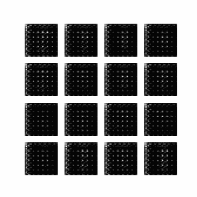
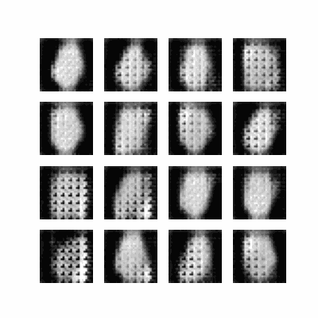

# DCGAN 

GANs or Generative Adversarial Networks are used for unsupervised learning of data disributions which, in turn, can be used for generating new data (generally images), which are very similar to the images present.


## How to install

```
pip install -r requirements.txt
```

## How to run

1. Open your terminal.
2. Navigate to the directory where the DCGAN_for_Fashion_MNIST.ipynb file is located.
3. Run the following command to convert the notebook file into a Python script:
   
```  
 ‍‍‍‍jupyter nbconvert --to script DCGAN_for_Fashion_MNIST.ipynb
```
   
4. This will create a Python script named DCGAN_for_Fashion_MNIST.py in the same directory.
5. Now, you can run the Python script using the following command:

   ```
   python DCGAN_for_Fashion_MNIST.py
   ```


## Mnist




## Fashion mnist

